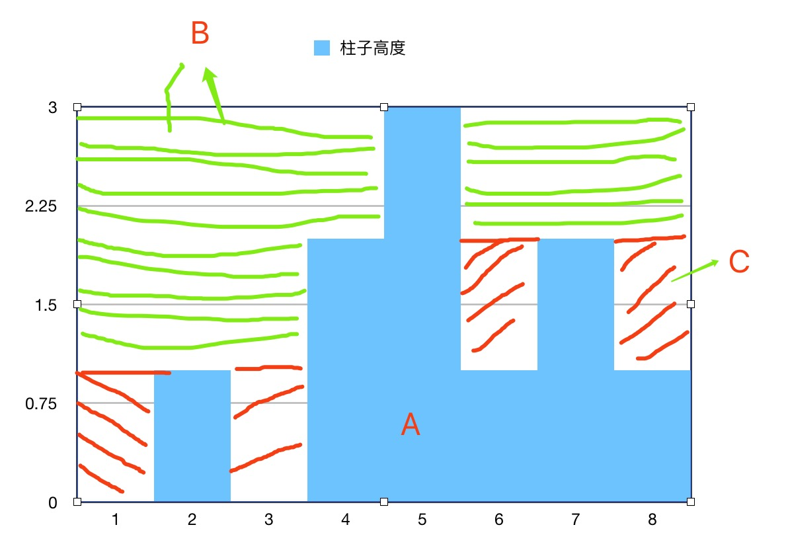
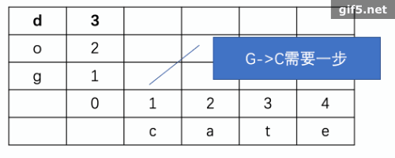
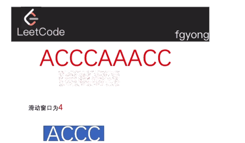
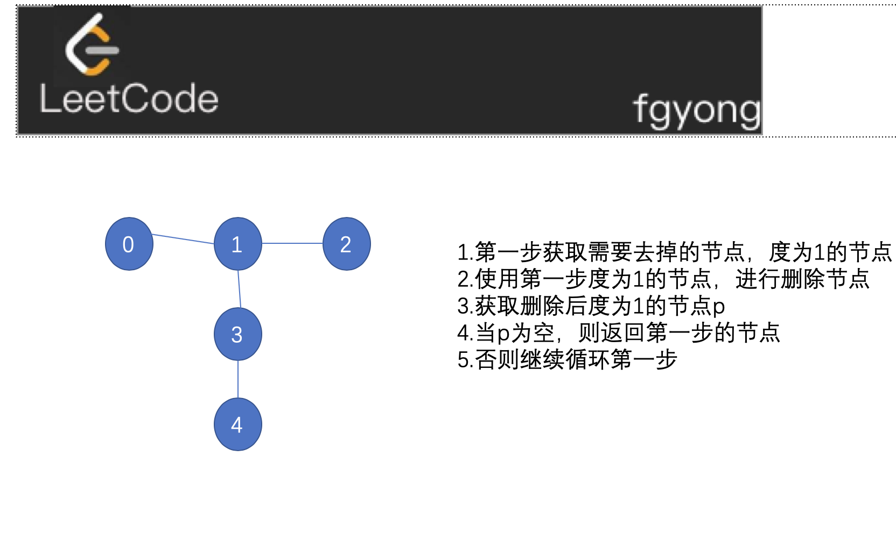

(设计者 **[fgyong]()**)
## Description

#### 本仓库旨在提高算法功法，感兴趣的可以关注。 不定期更新文章和题解。

## link

个人博客：

1. [fgyong的技术博客](www.fgyong.cn)
2. [掘金首页](https://juejin.im/user/5693a77b60b2c2974cdd7f7f)


## 算法题解模块

### 搜索模块
|类型|类型|link|
|:----:|:----:|:----:|
|搜索|搜索|[搜索二搜索维矩阵](https://github.com/ifgyong/leetCode/wiki/%5Bleetcdoe%E2%80%940074%5D-%E6%90%9C%E7%B4%A2%E4%BA%8C%E7%BB%B4%E7%9F%A9%E9%98%B5)<br />|

## 二叉树

|类型|类型|link|
|:----:|:----:|:----:|
|二叉树|遍历二叉树|[将有序数组转换为二叉搜索树](https://github.com/ifgyong/leetCode/wiki/%5Bleetcode--0103%5D%E4%BA%8C%E5%8F%89%E6%A0%91%E7%9A%84%E9%94%AF%E9%BD%BF%E5%BD%A2%E5%B1%82%E6%AC%A1%E9%81%8D%E5%8E%86)<br />[二叉树的锯齿形层次遍历](https://github.com/ifgyong/leetCode/wiki/%5Bleetcode--0103%5D%E4%BA%8C%E5%8F%89%E6%A0%91%E7%9A%84%E9%94%AF%E9%BD%BF%E5%BD%A2%E5%B1%82%E6%AC%A1%E9%81%8D%E5%8E%86)<br />[二叉树最大路径和](https://github.com/ifgyong/leetCode/wiki/%5Bleetcode--0124%5D%E4%BA%8C%E5%8F%89%E6%A0%91%E4%B8%AD%E7%9A%84%E6%9C%80%E5%A4%A7%E8%B7%AF%E5%BE%84%E5%92%8C)<br/> [二叉树的后序遍历](https://github.com/ifgyong/leetCode/wiki/%5Bleetcode--0145%5D%E4%BA%8C%E5%8F%89%E6%A0%91%E7%9A%84%E5%90%8E%E5%BA%8F%E9%81%8D%E5%8E%86)<br/> [从前序与中序遍历序列构造二叉树](https://github.com/ifgyong/leetCode/wiki/%5Bleetcode%E2%80%940105%5D%E4%BB%8E%E5%89%8D%E5%BA%8F%E4%B8%8E%E4%B8%AD%E5%BA%8F%E9%81%8D%E5%8E%86%E5%BA%8F%E5%88%97%E6%9E%84%E9%80%A0%E4%BA%8C%E5%8F%89%E6%A0%91)<br>[从二叉搜索树到更大和树](https://github.com/ifgyong/leetCode/wiki/%5Bleetcode%E2%80%941038%5D%E4%BB%8E%E4%BA%8C%E5%8F%89%E6%90%9C%E7%B4%A2%E6%A0%91%E5%88%B0%E6%9B%B4%E5%A4%A7%E5%92%8C%E6%A0%91)|
|图|图|[310.最小高度树](https://github.com/ifgyong/SF#310-%E6%9C%80%E5%B0%8F%E9%AB%98%E5%BA%A6%E6%A0%91)<br>[785.判断二分图](https://github.com/ifgyong/SF#785-%E5%88%A4%E6%96%AD%E4%BA%8C%E5%88%86%E5%9B%BE)<br>|


## The MIT License (MIT)

iOS-Source-Probe 以 MIT 开源协议发布，转载引用请注明出处。


#### 42 接雨水

给定 n 个非负整数表示每个宽度为 1 的柱子的高度图，计算按此排列的柱子，下雨之后能接多少雨水。


上面是由数组 [0,1,0,2,1,0,1,3,2,1,2,1] 表示的高度图，在这种情况下，可以接 6 个单位的雨水（蓝色部分表示雨水）。 感谢 Marcos 贡献此图。

示例:

```
输入: [0,1,0,2,1,0,1,3,2,1,2,1]
输出: 6
```

##### 题解
求雨水多少其实就是求阴影的面积，既然可以用求面积方法就可以转换思路了。




雨水`B`的总面积 = 总面积（A+B+C） - A (柱子面积) - B(空白面积)

```
class Solution {
class ObjIndexAndVal{
    int val;
    int index;
    ObjIndexAndVal(int val,int index){
        this.index = index;
        this.val = val;
    }
}
    public int trap(int[] height) {
         int val = 0,index=0;
        int defaultSize = 0;
        for (int i = 0; i < height.length; i++) {
            if (height[i] > val){
                val = height[i];
                index = i;
            }
            defaultSize += height[i];
        }
        if (height.length == 0)return 0;
        int l_max = height[0],r_max=height[height.length-1],r_index=height.length-1;
        for (int i = 1; i <= index ; i++) {
            if (height[i]  > l_max){
                int now_maxArea = (height[i]-l_max) *i;
                defaultSize += now_maxArea;
                l_max = height[i];
            }
        }
        for (int i = height.length-1; i >=index ; i--) {
            if (height[i]  > r_max){
                int now_maxArea = (height[i]-r_max) *(height.length-i-1);
                defaultSize += now_maxArea;
                r_max = height[i];
            }
        }
        int ret = val * height.length - defaultSize;
        return ret;
    }
}
```

#### 62 不同路径

一个机器人位于一个 m x n 网格的左上角 （起始点在下图中标记为`Start` ）。

机器人每次只能向下或者向右移动一步。机器人试图达到网格的右下角（在下图中标记为`Finish`）。

现在考虑网格中有障碍物。那么从左上角到右下角将会有多少条不同的路径？


网格中的障碍物和空位置分别用 1 和 0 来表示。

说明：m 和 n 的值均不超过 100。

```
示例 1:

输入:
[
  [0,0,0],
  [0,1,0],
  [0,0,0]
]
输出: 2
解释:
3x3 网格的正中间有一个障碍物。
从左上角到右下角一共有 2 条不同的路径：
1. 向右 -> 向右 -> 向下 -> 向下
2. 向下 -> 向下 -> 向右 -> 向右
```
##### 题解


其实每次只向下 或向右 只需要将整个图 缩略成只有4个格子的图则D的路径和等于B和C的路径和，当有2*3个格子，则F=C+E.
抽象成状态转移方程式则有
```
f(n,m)=f(n-1,m)+f(n,m-1)
```

```
class Solution {
 func uniquePaths(_ m: Int, _ n: Int) -> Int {
	let item = Array.init(repeating: 0, count: m+1)
	var dp = Array.init(repeating: item, count: n+1)
	dp[0][1] = 1//默认是一条路
	for i in 1...n{
		for j in 1...m{
			dp[i][j]=dp[i][j-1] + dp[i-1][j]//路径的总和等于 左边和上边的和
		}
	}
	return dp[n][m];
}
}

```

#### 63 不同路径II
和62不同是机器人走路有障碍
则在计算路径的时候，遇到障碍则进行不统计路线即可。

```
class Solution {
    func uniquePathsWithObstacles(_ obstacleGrid: [[Int]]) -> Int {
        
    let item = Array.init(repeating: 0, count: obstacleGrid[0].count+1)
	var dp = Array.init(repeating: item, count: obstacleGrid.count+1)
	dp[0][1] = 1//默认是一条路
	for i in 1...obstacleGrid.count{
		for j in 1...obstacleGrid[0].count{
			if obstacleGrid[i-1][j-1] == 1 {//有障碍物 则终端该路
				continue
			}
			dp[i][j]=dp[i][j-1] + dp[i-1][j]//路径的总和等于 左边和上边的和
		}
	}
	return dp[obstacleGrid.count][obstacleGrid[0].count];
    }
}

```

#### 64 最小路径和 
给定一个包含非负整数的 m x n 网格，请找出一条从左上角到右下角的路径，使得路径上的数字总和为最小。

说明：每次只能向下或者向右移动一步。

示例:
```
输入:
[
  [1,3,1],
  [1,5,1],
  [4,2,1]
]
输出: 7
解释: 因为路径 1→3→1→1→1 的总和最小。
```
##### 题解
其实最小路径和 使用动态规划比较简单，状态转移方程式是
> `f(m,n) = min(f(m-1,n),f(m,n-1))+grid(m,n)`

含义是坐标(m,n)的最小路径和等于上边和左边最小值加上当前的路径。

```
func minPathSum(_ grid: [[Int]]) -> Int {
    	let subArray = Array(repeating: 0, count: grid[0].count + 1)
var array = Array(repeating: subArray, count: grid.count + 1)
	
for i in 1...grid.count{
	for j in 1...grid[0].count{
		if i == 1 && j == 1 {
			array[i][j] = grid[i-1][j-1]
		}else if j == 1{
			array[i][j] = array[i-1][j]+grid[i-1][j-1]
		}else if i == 1{
			array[i][j] = array[i][j-1]+grid[i-1][j-1]
		}else{
			array[i][j] = min(array[i-1][j], array[i][j-1])+grid[i-1][j-1]
		}
	}
}
return array[grid.count][grid[0].count]
}
```

#### 72 编辑距离
##### 题目 给定两个单词 word1 和 word2，计算出将 word1 转换成 word2 所使用的最少操作数 。

你可以对一个单词进行如下三种操作：

插入一个字符
删除一个字符
替换一个字符

```
示例 1:

输入: word1 = "horse", word2 = "ros"
输出: 3
解释: 
horse -> rorse (将 'h' 替换为 'r')
rorse -> rose (删除 'r')
rose -> ros (删除 'e')
示例 2:

输入: word1 = "intention", word2 = "execution"
输出: 5
解释: 
intention -> inention (删除 't')
inention -> enention (将 'i' 替换为 'e')
enention -> exention (将 'n' 替换为 'x')
exention -> exection (将 'n' 替换为 'c')
exection -> execution (插入 'u')

```
##### 题解
dp看成二维数组，存储了str1[m]转换到str2[n]的步数，则最终的结果是 str1的最后一个字母转换到str2的最后一个字母，则是最终的结果。

具体步骤请看动图：




状态转移方程式：

当 `str[m] != str[n]`:

> f(m,n) = min(f(m-1,n-1)+1,f(m-1,n),f(m,n-1))

当 `str[m] == str[n]`:

> f(m,n) = min(f(m-1,n-1),f(m-1,n),f(m,n-1))

```
public int minDistance(String word1, String word2) {
     
    
    int n = word1.length();
    int m = word2.length();

    // if one of the strings is empty
    if (n * m == 0)
        return n + m;

    // array to store the convertion history
    int [][] d = new int[n + 1][m + 1];

    // init boundaries
    for (int i = 0; i < n + 1; i++) {
        d[i][0] = i;
    }
    for (int j = 0; j < m + 1; j++) {
        d[0][j] = j;
    }

    // 动态规划
    for (int i = 1; i < n + 1; i++) {
        for (int j = 1; j < m + 1; j++) {
            int left = d[i - 1][j] + 1;
            int down = d[i][j - 1] + 1;
            int left_down = d[i - 1][j - 1];
            if (word1.charAt(i - 1) != word2.charAt(j - 1))
                left_down += 1;
            d[i][j] = Math.min(left, Math.min(down, left_down));

        }
    }
    return d[n][m];
    
}

```

#### 120 最小路径和
##### 题目
给定一个三角形，找出自顶向下的最小路径和。每一步只能移动到下一行中相邻的结点上。

例如，给定三角形：

```
[
     [2],
    [3,4],
   [6,5,7],
  [4,1,8,3]
]

```
自顶向下的最小路径和为 11（即，2 + 3 + 5 + 1 = 11）。


说明：

如果你可以只使用 O(n) 的额外空间（n 为三角形的总行数）来解决这个问题，那么你的算法会很加分。
##### 题解
用i表示第`i`行，第`j`个数字。

状态转移方程式：

当 `j == 0` :

`f(i,j) = f(i-1,j) + f(i,j)`

当`j > 0`:

`f(i,j)  = min(f(i-1,j),f(i-1,j-1)) + f(i,j)`

> 算法自底而上或者自顶而下都可以

```java
public int minimumTotal(List<List<Integer>> triangle) {
         if (triangle.size() == 0)return 0;
    for (int i = triangle.size()-2; i >-1; i--) {
        List<Integer> sub0 = triangle.get(i);
        List<Integer> sub = triangle.get(i+1);
        for (int j = 0; j < sub.size()-1; j++) {
            Integer min = Math.min(sub.get(j),sub.get(j+1));
            sub0.set(j,min+sub0.get(j));
        }
    }
    return triangle.get(0).get(0);
}
```


##### 133. 克隆图
给定无向连通图中一个节点的引用，返回该图的深拷贝（克隆）。图中的每个节点都包含它的值 val（Int） 和其邻居的列表（list[Node]）。

示例：


```
输入：
{"$id":"1","neighbors":[{"$id":"2","neighbors":[{"$ref":"1"},{"$id":"3","neighbors":[{"$ref":"2"},{"$id":"4","neighbors":[{"$ref":"3"},{"$ref":"1"}],"val":4}],"val":3}],"val":2},{"$ref":"4"}],"val":1}
```
解释：
节点 1 的值是 1，它有两个邻居：节点 2 和 4 。
节点 2 的值是 2，它有两个邻居：节点 1 和 3 。
节点 3 的值是 3，它有两个邻居：节点 2 和 4 。
节点 4 的值是 4，它有两个邻居：节点 1 和 3 。


提示：

节点数介于 1 到 100 之间。
无向图是一个简单图，这意味着图中没有重复的边，也没有自环。
由于图是无向的，如果节点 p 是节点 q 的邻居，那么节点 q 也必须是节点 p 的邻居。
必须将给定节点的拷贝作为对克隆图的引用返回。


##### 题解
图的复制 将每个节点 hash存储，递归即可。
##### 代码
```
Map<Integer,Node> map = new HashMap<>();
        public Node cloneGraph(Node node) {
            if (map.containsKey(node.val)){
                return map.get(node.val);
            }else {
                Node node1 =new Node();
                node1.val = node.val;
                map.put(node1.val,node1);
                List<Node> list = new ArrayList<>();
                for (int i = 0; i < node.neighbors.size(); i++) {
                    list.add(cloneGraph(node.neighbors.get(i)));
                }
                node1.neighbors = list;

                return node1;
            }
        }
```


##### 179 最大数

给定一组非负整数，重新排列它们的顺序使之组成一个最大的整数。

```
示例 1:

输入: [10,2]
输出: 210
示例 2:

输入: [3,30,34,5,9]
输出: 9534330
说明: 输出结果可能非常大，所以你需要返回一个字符串而不是整数。

```
##### 题解
其实就是数字的排序的变种，这次排序是用的字符串而已。

```
    public String largestNumber(int[] nums) {
     //数字为空直接返回
  if (nums.length == 0)return "0";
        StringBuffer buffer = new StringBuffer();
        String[] ch = new String[nums.length];
        for (int i = 0; i < nums.length; i++) {
            ch[i] = String.valueOf(nums[i]);
        }

        for (int i = 0; i < nums.length; i++) {
            for (int j = i+1; j < nums.length; j++) {
                String a = ch[i]+ch[j];
                String b= ch[j]+ch[i];
                //把字符串a和b拼接比较 取出最大值
                if (a.compareTo(b)>0){
                    String tamp = ch[i];
                    ch[i] = ch[j];
                    ch[j] = tamp;
                }
            }
        }
        for (int i = ch.length-1; i >-1 ; i--) {
            buffer.append(ch[i]);
        }
        //判断是否是“0”
        if (buffer.charAt(0) == '0')return "0";
        return buffer.toString();
    }
```

#### 187 重复的DNA序列
##### 题目
所有 DNA 都由一系列缩写为 A，C，G 和 T 的核苷酸组成，例如：“ACGAATTCCG”。在研究 DNA 时，识别 DNA 中的重复序列有时会对研究非常有帮助。

编写一个函数来查找 DNA 分子中所有出现超过一次的 10 个字母长的序列（子串）。

```
示例：
输入：s = "AAAAACCCCCAAAAACCCCCCAAAAAGGGTTT"
输出：["AAAAACCCCC", "CCCCCAAAAA"]

```
##### 题解


其实是滑动窗口，窗口大小是10，只需要将每个窗口使用hash存储即可，当遇到hash中已有，则加入数组中。

```
    public List<String> findRepeatedDnaSequences(String s) {
         List<String> ret = new ArrayList<>();
        Map<String,Integer> map = new HashMap<>();
        for (int i = 0; i <= s.length()-10; i++) {
            String sub = s.substring(i,i+10);
            if (map.containsKey(sub)==false){
                map.put(sub,1);
            }else {
                int count = map.get(sub);
                if (count == 1){
                    ret.add(sub);
                }
                map.put(sub,count+1);

            }
        }
        return ret;
    }
```

#### 201 数字范围按位与 
##### 题目
给定范围 [m, n]，其中 0 <= m <= n <= 2147483647，返回此范围内所有数字的按位与（包含 m, n 两端点）。

```
示例 1: 

输入: [5,7]
输出: 4
示例 2:

输入: [0,1]
输出: 0
```

##### 题解

因为 只要有一个0，那么无论有多少个 1都是 0
所以只取较高位就好了。
比如：从 5到 7

> m右移动一位，n右移动一位，判断是否相等，不相等则继续迭代。直到相等

```
5:0 1 0 1
6:0 1 1 0
7:0 1 1 1
-----------
  0 1 0 0
```

```
    public int rangeBitwiseAnd(int m, int n) {
        int ret = m;
        int i = 0;
        while (m != n){
            m >>= 1;
            n >>= 1;
            i ++;
        }
        return m << i;
    }
```

#### 207 课程表

现在你总共有 n 门课需要选，记为 0 到 n-1。

在选修某些课程之前需要一些先修课程。 例如，想要学习课程 0 ，你需要先完成课程 1 ，我们用一个匹配来表示他们: [0,1]

给定课程总量以及它们的先决条件，判断是否可能完成所有课程的学习？

示例 1:

输入: 2, [[1,0]] 
输出: true
解释: 总共有 2 门课程。学习课程 1 之前，你需要完成课程 0。所以这是可能的。
示例 2:

输入: 2, [[1,0],[0,1]]
输出: false
解释: 总共有 2 门课程。学习课程 1 之前，你需要先完成​课程 0；并且学习课程 0 之前，你还应先完成课程 1。这是不可能的。
说明:

输入的先决条件是由边缘列表表示的图形，而不是邻接矩阵。详情请参见图的表示法。
你可以假定输入的先决条件中没有重复的边。
提示:

这个问题相当于查找一个循环是否存在于有向图中。如果存在循环，则不存在拓扑排序，因此不可能选取所有课程进行学习。
通过 DFS 进行拓扑排序 - 一个关于Coursera的精彩视频教程（21分钟），介绍拓扑排序的基本概念。
拓扑排序也可以通过 BFS 完成。
##### 题解
抽象成有向图中求环的思路即可，注意求环的 第一个点 必须有出度才行，入度为0，使用邻接矩阵和 拓扑排序即可完成本题。
#### 代码
```
// swift
func canFinish(_ numCourses: Int, _ prerequisites: [[Int]]) -> Bool {
	if prerequisites.count == 0 {
		return true
	}
	var array = Array(repeating: Array(repeating: 0, count: numCourses), count: numCourses)
	
	//构造邻接矩阵
	for  i  in 0..<prerequisites.count {
		let item = prerequisites[i]
		array[item[0]][item[1]] = 1
	}
	//入度统计
	var inArr = Array(repeating: 0, count: numCourses)
	//出度统计
	var outCount = Array(repeating: 0, count: numCourses)

	
	var dic = [Int:Int]()
	for i in prerequisites{
		inArr[i[1]] += 1 //入度
		outCount[i[0]] += 1//出度
		dic[i[0]] = 1
		dic[i[1]] = 1
	}
	//统计点
	let pCount = dic.keys.count
	
	var queue = [Int]()
	var count = 0
	//上边已经过滤掉了 空数组的情况，那么第一个入度为0的 一定有出度的才可以 开始
	for i  in 0..<inArr.count {
		if inArr[i] == 0  && outCount[i] > 0 {
			queue.append(i)
		}
	}
	
	while queue.isEmpty == false {
		let k = queue.removeLast()
		count += 1 //统计点的个数
		for j in 0..<numCourses{
			if array[k][j] == 1{
				inArr[j] -= 1 			//入度-1 剪断绳子
				if inArr[j] == 0 {
					queue.append(j)
				}
			}
		}
	}
	//取反  == 则无环，无环 则可以排课程表
	return (pCount == count)
}

```
### 210 课程表II
现在你总共有 n 门课需要选，记为 0 到 n-1。

在选修某些课程之前需要一些先修课程。 例如，想要学习课程 0 ，你需要先完成课程 1 ，我们用一个匹配来表示他们: [0,1]

给定课程总量以及它们的先决条件，返回你为了学完所有课程所安排的学习顺序。

可能会有多个正确的顺序，你只要返回一种就可以了。如果不可能完成所有课程，返回一个空数组。

示例 1:

输入: 2, [[1,0]] 
输出: [0,1]
解释: 总共有 2 门课程。要学习课程 1，你需要先完成课程 0。因此，正确的课程顺序为 [0,1] 。
示例 2:

输入: 4, [[1,0],[2,0],[3,1],[3,2]]
输出: [0,1,2,3] or [0,2,1,3]
解释: 总共有 4 门课程。要学习课程 3，你应该先完成课程 1 和课程 2。并且课程 1 和课程 2 都应该排在课程 0 之后。
     因此，一个正确的课程顺序是 [0,1,2,3] 。另一个正确的排序是 [0,2,1,3] 。
说明:

输入的先决条件是由边缘列表表示的图形，而不是邻接矩阵。详情请参见图的表示法。
你可以假定输入的先决条件中没有重复的边。
提示:

这个问题相当于查找一个循环是否存在于有向图中。如果存在循环，则不存在拓扑排序，因此不可能选取所有课程进行学习。
通过 DFS 进行拓扑排序 - 一个关于Coursera的精彩视频教程（21分钟），介绍拓扑排序的基本概念。
拓扑排序也可以通过 BFS 完成。

### 题解
根据有向图的 是否有环来判断是否有正确的顺序来安排课程，有环则返回空，无环则按照拓扑排序输出，注意  没有依赖的课程最后也是需要 安排进去的。

```
// swift
func findOrder(_ numCourses: Int, _ prerequisites: [[Int]]) -> [Int] {
	var defaultList = [Int]()
	
	if prerequisites.count == 0 {
		for i in 0..<numCourses{
			defaultList.insert(i, at: 0)
		}
		return defaultList
	}
	var array = Array(repeating: Array(repeating: 0, count: numCourses), count: numCourses)
	
	//构造邻接矩阵
	for  i  in 0..<prerequisites.count {
		let item = prerequisites[i]
		array[item[0]][item[1]] = 1
	}
	//入度统计
	var inArr = Array(repeating: 0, count: numCourses)
	//出度统计
	var outCount = Array(repeating: 0, count: numCourses)

	
	var dic = [Int:Int]()
	for i in prerequisites{
		inArr[i[1]] += 1 //入度
		outCount[i[0]] += 1//出度
		dic[i[0]] = 1
		dic[i[1]] = 1
	}
	//统计点
	let pCount = dic.keys.count
	
	var queue = [Int]()
	var count = 0
	//上边已经过滤掉了 空数组的情况，那么第一个入度为0的 一定有出度的才可以 开始
	for i  in 0..<inArr.count {
		if inArr[i] == 0  && outCount[i] > 0 {
			queue.append(i)
			defaultList.insert(i, at: 0)
		}
	}
	
	while queue.isEmpty == false {
		let k = queue.removeLast()
		count += 1 //统计点的个数
		for j in 0..<numCourses{
			if array[k][j] == 1{
				inArr[j] -= 1 			//入度-1 剪断绳子
				if inArr[j] == 0 {
					queue.append(j)
					defaultList.insert(j, at: 0)
				}
			}
		}
	}
	//有环
	if pCount != count {
		return [Int]()
	}
	if defaultList.count == numCourses {
		return defaultList
	}
	
	for  i in 0..<numCourses {
		if dic.keys.contains(i) == false{
			defaultList.insert(i, at: 0)
		}
	}
	return defaultList
}

```
### 310 最小高度树
对于一个具有树特征的无向图，我们可选择任何一个节点作为根。图因此可以成为树，在所有可能的树中，具有最小高度的树被称为最小高度树。给出这样的一个图，写出一个函数找到所有的最小高度树并返回他们的根节点。

格式

该图包含 n 个节点，标记为 0 到 n - 1。给定数字 n 和一个无向边 edges 列表（每一个边都是一对标签）。

你可以假设没有重复的边会出现在 edges 中。由于所有的边都是无向边， [0, 1]和 [1, 0] 是相同的，因此不会同时出现在 edges 里。

示例 1:

输入: n = 4, edges = [[1, 0], [1, 2], [1, 3]]

        0
        |
        1
       / \
      2   3 

输出: [1]
示例 2:

输入: n = 6, edges = [[0, 3], [1, 3], [2, 3], [4, 3], [5, 4]]

     0  1  2
      \ | /
        3
        |
        4
        |
        5 

输出: [3, 4]
说明:

 根据树的定义，树是一个无向图，其中任何两个顶点只通过一条路径连接。 换句话说，一个任何没有简单环路的连通图都是一棵树。
树的高度是指根节点和叶子节点之间最长向下路径上边的数量。
### 题解

### 代码
#### 邻接矩阵
```
func findMinHeightTrees(_ n: Int, _ edges: [[Int]]) -> [Int] {
   if n < 1 {
	   return [Int]()
   }else if n == 1{
	   return [0]
   }else if n == 2{
	   return [0,1]
   }
   
   var duCount = Array(repeating: 0, count: n)
   var v = Array(repeating: Array(repeating: 0, count: n), count: n)
   
   //统计度 《出度和入度》
   for i in 0..<edges.count {
	   let i0 = edges[i][0]
	   let i1 = edges[i][1]
	   duCount[i0] += 1
	   duCount[i1] += 1
	   
	   v[i0][i1] = 1
	   v[i1][i0] = 1//邻接矩阵 表示无向图
   }

	var values = Dictionary<Int,Int>()
	var needDelPoint = [Int]()
	for i in 0..<duCount.count {
		if duCount[i] == 1  {
			values[i] = 1//需要处理的节点
			needDelPoint.append(i)
		}
	}
	while true {
		var nextNeedDeleteP = [Int]()//第二次处理的 节点集合
		for i in 0..<needDelPoint.count{
			let g = needDelPoint[i]
			for k in 0..<n {//去节点
				if v[g][k] == 1 {
					v[g][k] = 0 //剪枝
					v[k][g] = 0
					
					duCount[g] -= 1
					duCount[k] -= 1
					if duCount[k] == 1{
						nextNeedDeleteP.append(k)
					}
					break
				}
			}
		}
		if nextNeedDeleteP.count < 2 {
			if nextNeedDeleteP.count == 0 {
				return needDelPoint;
			}
			return nextNeedDeleteP;
		}else{
			needDelPoint = nextNeedDeleteP
		}
		
	}
}
```
#### 邻接链表
```
func findMinHeightTrees(_ n: Int, _ edges: [[Int]]) -> [Int] {
	if n == 1{
		return [0]
	}else if n == 2{
		return [0,1]
	}else if n==0{
		return [Int]()
	}

	var arr = Array(repeating: Set<Int>(), count: n)
	var duCount = Array(repeating: 0, count: n)
	//构造邻接链表
	for i in 0..<edges.count {
		let i0 = edges[i][0],i1 = edges[i][1]
		duCount[i0] += 1
		duCount[i1] += 1
		arr[i0].insert(i1)
		arr[i1].insert(i0)
	}
	//记录节点 度=1的的节点
	var delArr = [Int]()
	var nextDelArr = delArr
	
	for i in 0..<duCount.count{
		if duCount[i] == 1 {
			delArr.append(i)
		}
	}
	while true {
		nextDelArr.removeAll()
		for i in delArr{
			guard let d = arr[i].popFirst() else {
				continue
			}
			arr[d].remove(i)
			if arr[d].count == 1{
				nextDelArr.append(d)
			}
		}
		if nextDelArr.count == 0 {
			return delArr
		}else if nextDelArr.count == 1{
			return nextDelArr
		}else{
			delArr = nextDelArr
		}
	}
	
	return [0]
}

```

### 765 情侣牵手

N 对情侣坐在连续排列的 2N 个座位上，想要牵到对方的手。 计算最少交换座位的次数，以便每对情侣可以并肩坐在一起。 一次交换可选择任意两人，让他们站起来交换座位。

人和座位用 0 到 2N-1 的整数表示，情侣们按顺序编号，第一对是 (0, 1)，第二对是 (2, 3)，以此类推，最后一对是 (2N-2, 2N-1)。

这些情侣的初始座位  row[i] 是由最初始坐在第 i 个座位上的人决定的。

示例 1:
```
输入: row = [0, 2, 1, 3]
输出: 1
解释: 我们只需要交换row[1]和row[2]的位置即可。
```
示例 2:
```
输入: row = [3, 2, 0, 1]
输出: 0
解释: 无需交换座位，所有的情侣都已经可以手牵手了。
```
说明:

len(row) 是偶数且数值在 [4, 60]范围内。
可以保证row 是序列 0...len(row)-1 的一个全排列。

### 解题思路

1. 确认当前位置的另外一位
2. 找到情侣另外一个人，交换次数+1
3. 复杂度 O(n^2)，数据量大的话可以使用hash来存储情侣号码和座位号 复杂度降为O(n)

### 代码

```swift
class Solution {
    func minSwapsCouples(_ row: [Int]) -> Int {
        var rowMut = row
	
	if row.count < 4  || row.count > 60	{
		return -1
	}
	let mid = row.count/2
	var exCount = 0;
	for i in 0..<mid{
		let l = rowMut[i*2];
		let r = rowMut[i*2+1]
		var l_wife = 0
		if l%2 == 0 {
			l_wife = l + 1
		}else{
			l_wife = l - 1
		}
		if l_wife == r {
			continue
		}
		exCount += 1;
		
		var index_wife = -1
		for j in 0..<rowMut.count{
			if rowMut[j] == l_wife {
				index_wife = j
				break
			}
		}
		if index_wife != -1 {
			let swap = rowMut[i*2+1]
			rowMut[i*2+1] = rowMut[index_wife]
			rowMut[index_wife] = swap
		}
	}
	return exCount;
    }
}
```
### 785 判断二分图
给定一个无向图graph，当这个图为二分图时返回true。

如果我们能将一个图的节点集合分割成两个独立的子集A和B，并使图中的每一条边的两个节点一个来自A集合，一个来自B集合，我们就将这个图称为二分图。

graph将会以邻接表方式给出，graph[i]表示图中与节点i相连的所有节点。每个节点都是一个在0到graph.length-1之间的整数。这图中没有自环和平行边： graph[i] 中不存在i，并且graph[i]中没有重复的值。

```
示例 1:
输入: [[1,3], [0,2], [1,3], [0,2]]
输出: true
解释: 
无向图如下:
0----1
|    |
|    |
3----2
我们可以将节点分成两组: {0, 2} 和 {1, 3}。

示例 2:
输入: [[1,2,3], [0,2], [0,1,3], [0,2]]
输出: false
解释: 
无向图如下:
0----1
| \  |
|  \ |
3----2
我们不能将节点分割成两个独立的子集。
注意:

graph 的长度范围为 [1, 100]。
graph[i] 中的元素的范围为 [0, graph.length - 1]。
graph[i] 不会包含 i 或者有重复的值。
图是无向的: 如果j 在 graph[i]里边, 那么 i 也会在 graph[j]里边。

```

#### 题解
染色法，将节点染色成相邻接点为不同颜色即可，颜色染完仍然颜色无重复及可以二分，否则不可。

```
func isBipartite(_ graph: [[Int]]) -> Bool {
	let length  = graph.count

	var color = Array(repeating: -1, count: length)//记录每个节点的颜色
	
	for i in 0..<length{//遍历节点
		if color[i] == -1 {//默认参数
			var queue = [Int]()
			queue.append(i)
			while queue.isEmpty == false {
				guard let p = queue.popLast() else{
					continue
				}
				for j in graph[p] {
					if color[j] == -1 {//未染色的 现在染色
						queue.append(j)
						color[j] = color[p]^1
					}else if color[j] == color[p]{//如果颜色和上个节点颜色一样，则返回false
						return false
					}
				}
			}
		}
	}
	return true
}
```

### 1267
#### 题目
这里有一幅服务器分布图，服务器的位置标识在 m * n 的整数矩阵网格 grid 中，1 表示单元格上有服务器，0 表示没有。

如果两台服务器位于同一行或者同一列，我们就认为它们之间可以进行通信。

请你统计并返回能够与至少一台其他服务器进行通信的服务器的数量。

```

示例 1：

输入：grid = [[1,0],[0,1]]
输出：0
解释：没有一台服务器能与其他服务器进行通信。
示例 2：

输入：grid = [[1,0],[1,1]]
输出：3
解释：所有这些服务器都至少可以与一台别的服务器进行通信。
示例 3：

输入：grid = [[1,1,0,0],[0,0,1,0],[0,0,1,0],[0,0,0,1]]
输出：4
解释：第一行的两台服务器互相通信，第三列的两台服务器互相通信，但右下角的服务器无法与其他服务器通信。
 

提示：

m == grid.length
n == grid[i].length
1 <= m <= 250
1 <= n <= 250
grid[i][j] == 0 or 1
```
链接：https://leetcode-cn.com/problems/count-servers-that-communicate

#### 题解
按照每行每列统计，当每行大于1 或每列大于1 则进入计数。

```
    public int countServers2(int[][] grid) {
    //统计每行的服务器个数
        int[] rows = new int[grid.length];
        //统计每列服务器个数
        int[] cols = new int[grid[0].length];
        for (int i = 0; i < rows.length; i++) {
            for (int j = 0; j < cols.length; j++) {
                if (grid[i][j] == 1){
                    rows[i] ++;
                    cols[j] ++;
                }
            }
        }
        int ret = 0;
        for (int i = 0; i < rows.length ; i++) {
            for (int j = 0; j < cols.length; j++) {
                if (grid[i][j] == 1 &&(rows[i]> 1 || cols[j] > 1)){
                    ret ++;
                }
            }
        }
        return  ret;
    }
```
或者使用dfs搜索
```
class Tupe{
    int x;
    int y;
    Tupe(int x,int y){
        this.x = x;
        this.y = y;
    }
Map<Integer,Integer>cols = new HashMap<>();
    Map<Integer,Integer>rows = new HashMap<>();
    public int countServers(int[][] grid) {
        int[][] visited = new int[grid.length][grid[0].length];
        int ret = 0;
        for (int i = 0; i < grid.length; i++) {
            for (int j = 0; j < grid[0].length; j++) {
                if (grid[i][j] == 1 && visited[i][j] == 0){
                    visited[i][j] = 1;
                    Tupe tupe = new Tupe(i,j);
                    int all = findAllComputer(tupe,grid,visited);
                    if (all > 0){
                        ret = ret + 1 + all;
                    }
                }else {
                    visited[i][j] = 1;
                }
            }
        }
        return ret;
    }
    public int findAllComputer(Tupe tupe,int[][] grid,int[][] visited){
        Stack<Tupe> stack = new Stack<>();
        stack.add(tupe);
        int count = 0;
        while (stack.isEmpty() ==false){
            Tupe tupe1 = stack.pop();
            if (rows.containsKey(tupe1.y)==false){
                for (int i = 0; i < visited.length; i++) {
                    if (grid[i][tupe1.y] == 1 && visited[i][tupe1.y] != 1){
                        visited[i][tupe1.y]=1;
                        Tupe subTp= new Tupe(i,tupe1.y);
                        stack.add(subTp);
                        count += 1;
                    }else {
                        visited[i][tupe1.y]=1;
                    }
                }
            }


            if (cols.containsKey(tupe1.x)==false){
                cols.put(tupe1.x,1);
                for (int i = 0; i < visited[0].length; i++) {
                    if (grid[tupe1.x][i] == 1 && visited[tupe1.x][i] != 1){
                        visited[tupe1.x][i]=1;
                        stack.add(new Tupe(tupe1.x,i));
                        count += 1;
                    }else {
                        visited[tupe1.x][i]=1;
                    }
                }
            }
        }
        return count;
    }
```
