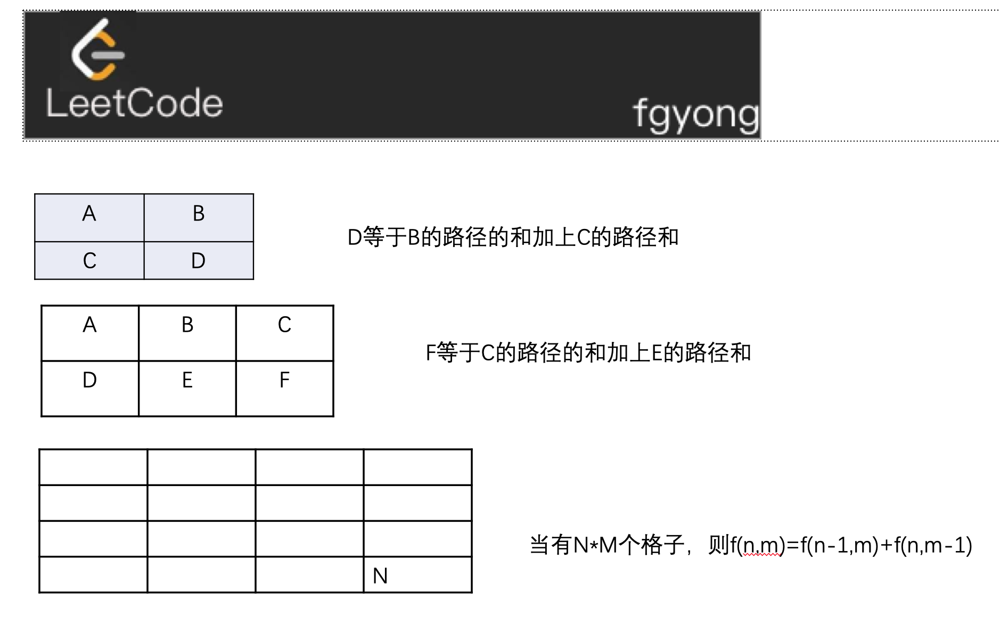

(设计者 **[fgyong]()**)
## Description

#### 本仓库旨在提高算法功法，感兴趣的可以关注。 不定期更新文章和题解。

## link

个人博客：

1. [兜兜转转的技术博客](www.fgyong.cn)
2. [掘金首页](https://juejin.im/user/5693a77b60b2c2974cdd7f7f)


## 算法题解模块

### 搜索模块
|类型|类型|link|
|:----:|:----:|:----:|
|搜索|搜索|[搜索二搜索维矩阵](https://github.com/ifgyong/leetCode/wiki/%5Bleetcdoe%E2%80%940074%5D-%E6%90%9C%E7%B4%A2%E4%BA%8C%E7%BB%B4%E7%9F%A9%E9%98%B5)<br />|

## 二叉树

|类型|类型|link|
|:----:|:----:|:----:|
|二叉树|遍历二叉树|[将有序数组转换为二叉搜索树](https://github.com/ifgyong/leetCode/wiki/%5Bleetcode--0103%5D%E4%BA%8C%E5%8F%89%E6%A0%91%E7%9A%84%E9%94%AF%E9%BD%BF%E5%BD%A2%E5%B1%82%E6%AC%A1%E9%81%8D%E5%8E%86)<br />[二叉树的锯齿形层次遍历](https://github.com/ifgyong/leetCode/wiki/%5Bleetcode--0103%5D%E4%BA%8C%E5%8F%89%E6%A0%91%E7%9A%84%E9%94%AF%E9%BD%BF%E5%BD%A2%E5%B1%82%E6%AC%A1%E9%81%8D%E5%8E%86)<br />[二叉树最大路径和](https://github.com/ifgyong/leetCode/wiki/%5Bleetcode--0124%5D%E4%BA%8C%E5%8F%89%E6%A0%91%E4%B8%AD%E7%9A%84%E6%9C%80%E5%A4%A7%E8%B7%AF%E5%BE%84%E5%92%8C)<br/> [二叉树的后序遍历](https://github.com/ifgyong/leetCode/wiki/%5Bleetcode--0145%5D%E4%BA%8C%E5%8F%89%E6%A0%91%E7%9A%84%E5%90%8E%E5%BA%8F%E9%81%8D%E5%8E%86)<br/> [从前序与中序遍历序列构造二叉树](https://github.com/ifgyong/leetCode/wiki/%5Bleetcode%E2%80%940105%5D%E4%BB%8E%E5%89%8D%E5%BA%8F%E4%B8%8E%E4%B8%AD%E5%BA%8F%E9%81%8D%E5%8E%86%E5%BA%8F%E5%88%97%E6%9E%84%E9%80%A0%E4%BA%8C%E5%8F%89%E6%A0%91)<br>[从二叉搜索树到更大和树](https://github.com/ifgyong/leetCode/wiki/%5Bleetcode%E2%80%941038%5D%E4%BB%8E%E4%BA%8C%E5%8F%89%E6%90%9C%E7%B4%A2%E6%A0%91%E5%88%B0%E6%9B%B4%E5%A4%A7%E5%92%8C%E6%A0%91)|


## The MIT License (MIT)

iOS-Source-Probe 以 MIT 开源协议发布，转载引用请注明出处。


#### 62 不同路径

一个机器人位于一个 m x n 网格的左上角 （起始点在下图中标记为“Start” ）。

机器人每次只能向下或者向右移动一步。机器人试图达到网格的右下角（在下图中标记为“Finish”）。

现在考虑网格中有障碍物。那么从左上角到右下角将会有多少条不同的路径？


网格中的障碍物和空位置分别用 1 和 0 来表示。

说明：m 和 n 的值均不超过 100。

```
示例 1:

输入:
[
  [0,0,0],
  [0,1,0],
  [0,0,0]
]
输出: 2
解释:
3x3 网格的正中间有一个障碍物。
从左上角到右下角一共有 2 条不同的路径：
1. 向右 -> 向右 -> 向下 -> 向下
2. 向下 -> 向下 -> 向右 -> 向右
```
##### 题解


其实每次只向下 或向右 只需要将整个图 缩略成只有4个格子的图则D的路径和等于B和C的路径和，当有2*3个格子，则F=C+E.
抽象成状态转移方程式则有
```
f(n,m)=f(n-1,m)+f(n,m-1)
```

```
class Solution {
 func uniquePaths(_ m: Int, _ n: Int) -> Int {
	let item = Array.init(repeating: 0, count: m+1)
	var dp = Array.init(repeating: item, count: n+1)
	dp[0][1] = 1//默认是一条路
	for i in 1...n{
		for j in 1...m{
			dp[i][j]=dp[i][j-1] + dp[i-1][j]//路径的总和等于 左边和上边的和
		}
	}
	return dp[n][m];
}
}

```

#### 63 不同路径II
和62不同是机器人走路有障碍
则在计算路径的时候，遇到障碍则进行不统计路线即可。

```
class Solution {
    func uniquePathsWithObstacles(_ obstacleGrid: [[Int]]) -> Int {
        
    let item = Array.init(repeating: 0, count: obstacleGrid[0].count+1)
	var dp = Array.init(repeating: item, count: obstacleGrid.count+1)
	dp[0][1] = 1//默认是一条路
	for i in 1...obstacleGrid.count{
		for j in 1...obstacleGrid[0].count{
			if obstacleGrid[i-1][j-1] == 1 {//有障碍物 则终端该路
				continue
			}
			dp[i][j]=dp[i][j-1] + dp[i-1][j]//路径的总和等于 左边和上边的和
		}
	}
	return dp[obstacleGrid.count][obstacleGrid[0].count];
    }
}

```

##### 179 最大数

给定一组非负整数，重新排列它们的顺序使之组成一个最大的整数。

```
示例 1:

输入: [10,2]
输出: 210
示例 2:

输入: [3,30,34,5,9]
输出: 9534330
说明: 输出结果可能非常大，所以你需要返回一个字符串而不是整数。

```
##### 题解
其实就是数字的排序的变种，这次排序是用的字符串而已。

```
    public String largestNumber(int[] nums) {
     //数字为空直接返回
  if (nums.length == 0)return "0";
        StringBuffer buffer = new StringBuffer();
        String[] ch = new String[nums.length];
        for (int i = 0; i < nums.length; i++) {
            ch[i] = String.valueOf(nums[i]);
        }

        for (int i = 0; i < nums.length; i++) {
            for (int j = i+1; j < nums.length; j++) {
                String a = ch[i]+ch[j];
                String b= ch[j]+ch[i];
                //把字符串a和b拼接比较 取出最大值
                if (a.compareTo(b)>0){
                    String tamp = ch[i];
                    ch[i] = ch[j];
                    ch[j] = tamp;
                }
            }
        }
        for (int i = ch.length-1; i >-1 ; i--) {
            buffer.append(ch[i]);
        }
        //判断是否是“0”
        if (buffer.charAt(0) == '0')return "0";
        return buffer.toString();
    }
```

#### 187 重复的DNA序列
##### 题目
所有 DNA 都由一系列缩写为 A，C，G 和 T 的核苷酸组成，例如：“ACGAATTCCG”。在研究 DNA 时，识别 DNA 中的重复序列有时会对研究非常有帮助。

编写一个函数来查找 DNA 分子中所有出现超过一次的 10 个字母长的序列（子串）。

```
示例：
输入：s = "AAAAACCCCCAAAAACCCCCCAAAAAGGGTTT"
输出：["AAAAACCCCC", "CCCCCAAAAA"]

```
##### 题解


其实是滑动窗口，窗口大小是10，只需要将每个窗口使用hash存储即可，当遇到hash中已有，则加入数组中。

```
    public List<String> findRepeatedDnaSequences(String s) {
         List<String> ret = new ArrayList<>();
        Map<String,Integer> map = new HashMap<>();
        for (int i = 0; i <= s.length()-10; i++) {
            String sub = s.substring(i,i+10);
            if (map.containsKey(sub)==false){
                map.put(sub,1);
            }else {
                int count = map.get(sub);
                if (count == 1){
                    ret.add(sub);
                }
                map.put(sub,count+1);

            }
        }
        return ret;
    }
```

#### 201 数字范围按位与 
##### 题目
给定范围 [m, n]，其中 0 <= m <= n <= 2147483647，返回此范围内所有数字的按位与（包含 m, n 两端点）。

```
示例 1: 

输入: [5,7]
输出: 4
示例 2:

输入: [0,1]
输出: 0
```

##### 题解

因为 只要有一个0，那么无论有多少个 1都是 0
所以只取较高位就好了。
比如：从 5到 7

> m右移动一位，n右移动一位，判断是否相等，不相等则继续迭代。直到相等

```
5:0 1 0 1
6:0 1 1 0
7:0 1 1 1
-----------
  0 1 0 0
```

```
    public int rangeBitwiseAnd(int m, int n) {
        int ret = m;
        int i = 0;
        while (m != n){
            m >>= 1;
            n >>= 1;
            i ++;
        }
        return m << i;
    }
```
### 1267
#### 题目
这里有一幅服务器分布图，服务器的位置标识在 m * n 的整数矩阵网格 grid 中，1 表示单元格上有服务器，0 表示没有。

如果两台服务器位于同一行或者同一列，我们就认为它们之间可以进行通信。

请你统计并返回能够与至少一台其他服务器进行通信的服务器的数量。

```

示例 1：

输入：grid = [[1,0],[0,1]]
输出：0
解释：没有一台服务器能与其他服务器进行通信。
示例 2：

输入：grid = [[1,0],[1,1]]
输出：3
解释：所有这些服务器都至少可以与一台别的服务器进行通信。
示例 3：

输入：grid = [[1,1,0,0],[0,0,1,0],[0,0,1,0],[0,0,0,1]]
输出：4
解释：第一行的两台服务器互相通信，第三列的两台服务器互相通信，但右下角的服务器无法与其他服务器通信。
 

提示：

m == grid.length
n == grid[i].length
1 <= m <= 250
1 <= n <= 250
grid[i][j] == 0 or 1
```
链接：https://leetcode-cn.com/problems/count-servers-that-communicate

#### 题解
按照每行每列统计，当每行大于1 或每列大于1 则进入计数。

```
    public int countServers2(int[][] grid) {
    //统计每行的服务器个数
        int[] rows = new int[grid.length];
        //统计每列服务器个数
        int[] cols = new int[grid[0].length];
        for (int i = 0; i < rows.length; i++) {
            for (int j = 0; j < cols.length; j++) {
                if (grid[i][j] == 1){
                    rows[i] ++;
                    cols[j] ++;
                }
            }
        }
        int ret = 0;
        for (int i = 0; i < rows.length ; i++) {
            for (int j = 0; j < cols.length; j++) {
                if (grid[i][j] == 1 &&(rows[i]> 1 || cols[j] > 1)){
                    ret ++;
                }
            }
        }
        return  ret;
    }
```
或者使用dfs搜索
```
class Tupe{
    int x;
    int y;
    Tupe(int x,int y){
        this.x = x;
        this.y = y;
    }
Map<Integer,Integer>cols = new HashMap<>();
    Map<Integer,Integer>rows = new HashMap<>();
    public int countServers(int[][] grid) {
        int[][] visited = new int[grid.length][grid[0].length];
        int ret = 0;
        for (int i = 0; i < grid.length; i++) {
            for (int j = 0; j < grid[0].length; j++) {
                if (grid[i][j] == 1 && visited[i][j] == 0){
                    visited[i][j] = 1;
                    Tupe tupe = new Tupe(i,j);
                    int all = findAllComputer(tupe,grid,visited);
                    if (all > 0){
                        ret = ret + 1 + all;
                    }
                }else {
                    visited[i][j] = 1;
                }
            }
        }
        return ret;
    }
    public int findAllComputer(Tupe tupe,int[][] grid,int[][] visited){
        Stack<Tupe> stack = new Stack<>();
        stack.add(tupe);
        int count = 0;
        while (stack.isEmpty() ==false){
            Tupe tupe1 = stack.pop();
            if (rows.containsKey(tupe1.y)==false){
                for (int i = 0; i < visited.length; i++) {
                    if (grid[i][tupe1.y] == 1 && visited[i][tupe1.y] != 1){
                        visited[i][tupe1.y]=1;
                        Tupe subTp= new Tupe(i,tupe1.y);
                        stack.add(subTp);
                        count += 1;
                    }else {
                        visited[i][tupe1.y]=1;
                    }
                }
            }


            if (cols.containsKey(tupe1.x)==false){
                cols.put(tupe1.x,1);
                for (int i = 0; i < visited[0].length; i++) {
                    if (grid[tupe1.x][i] == 1 && visited[tupe1.x][i] != 1){
                        visited[tupe1.x][i]=1;
                        stack.add(new Tupe(tupe1.x,i));
                        count += 1;
                    }else {
                        visited[tupe1.x][i]=1;
                    }
                }
            }
        }
        return count;
    }
```
